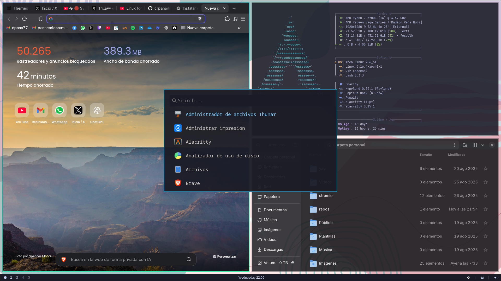

# primer config en linux usando hyprland como windows manager.

##programas instalados

- **alacritty** --> terminal
- **waybar** ---> barra de estado
- **brave** ---> navegador
- **nautilus** ---> gestor de archivos
- **fastfetch** ---> info de sistema
- **swaybg** ---> fondo de pantalla
- **hyprshot** ---> captura de pantalla
- **walker** ---> lanzador de aplicaciones
  

